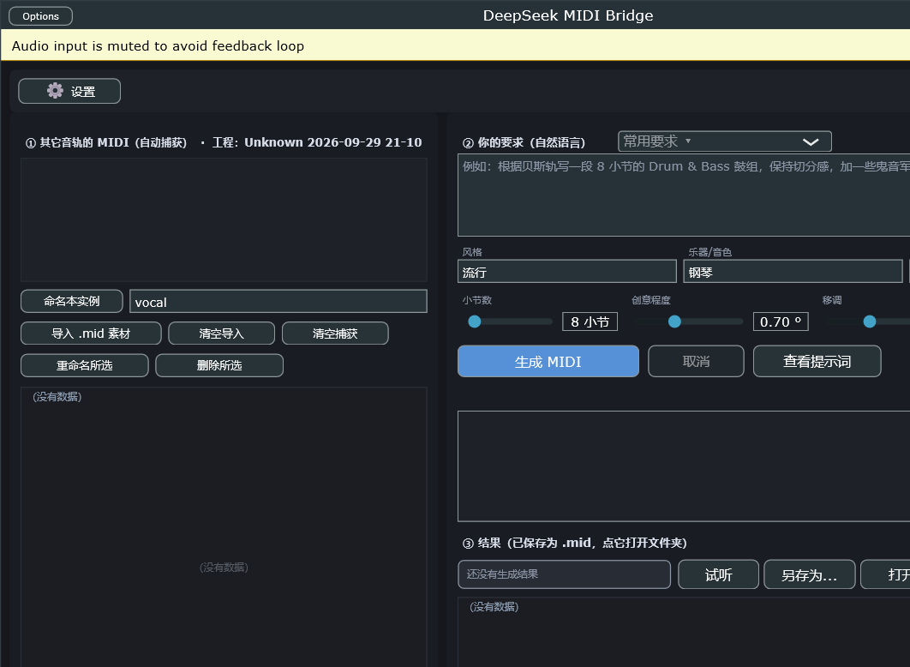
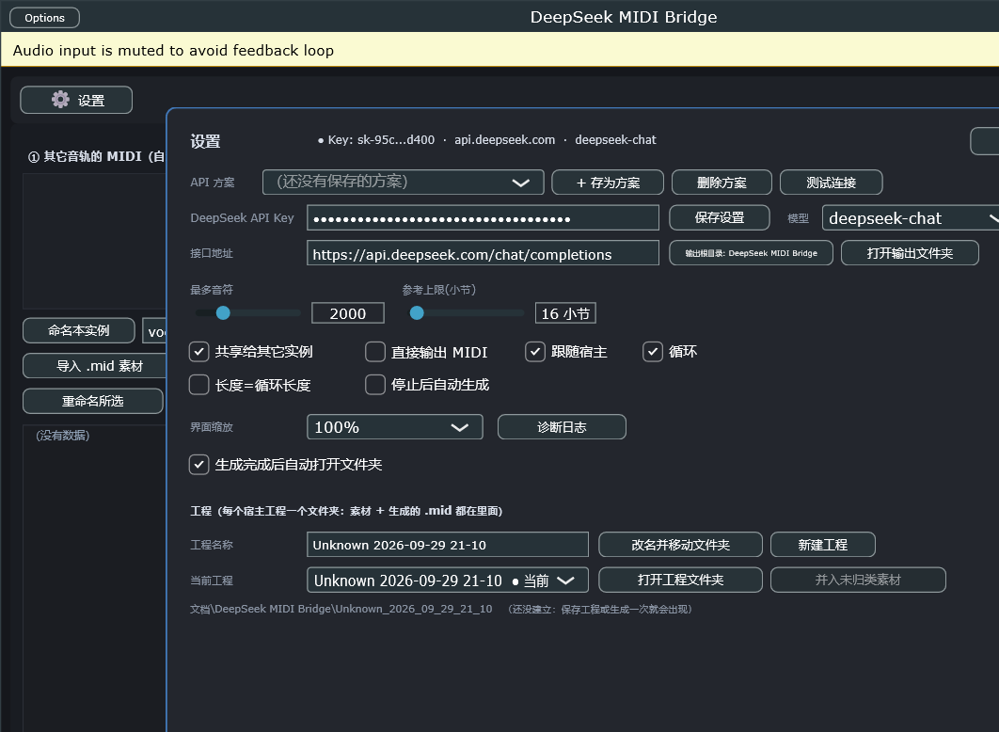
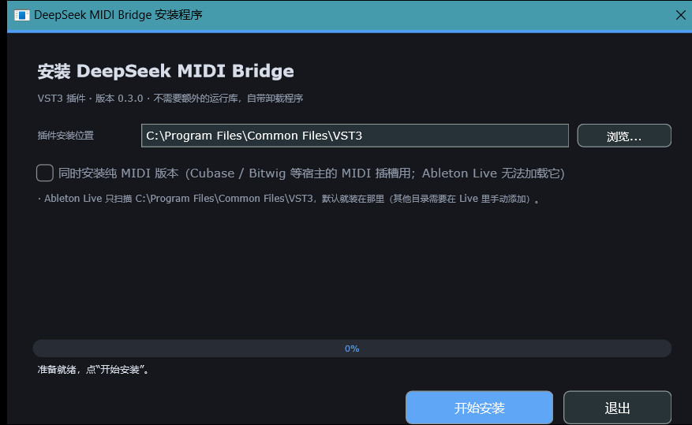
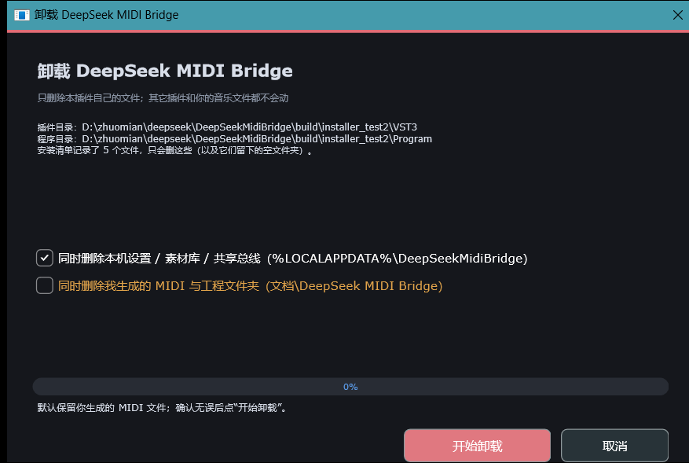

# DeepSeek MIDI Bridge

一个 VST3 插件：**读取宿主里其它音轨的 MIDI → 调用 DeepSeek API 按你的要求生成新的 MIDI → 生成完自动打开文件夹，把 `.mid` 拖进 Ableton Live 变成 clip**。

> 📖 **详实使用手册（每个功能、每个按钮的说明）**：[docs/使用手册.md](docs/使用手册.md) ·
> [docs/使用手册.docx](docs/使用手册.docx)（Word 版，安装程序也会把它装到程序目录里）

**一键安装包**：到 [Releases](../../releases) 下载 `DeepSeekMIDIBridge-Setup-*.exe`（单文件，自带卸载程序，
不需要任何运行库），双击即可。也可以按 §2.1 从源码构建。

| 插件界面 | 设置面板 |
|---|---|
|  |  |

| 安装程序 | 卸载程序 |
|---|---|
|  |  |

适用宿主：**任何支持 VST3 的宿主**（Ableton Live 10.1+ / 11 / 12 实测通过；Cubase/Nuendo、Studio One、REAPER、Bitwig、FL Studio、Waveform 等同样可用，见 §4.5）。
平台：Windows x64（32 位宿主不支持）。

---

## 1. 它是怎么工作的

VST3 插件天生只能看到"流经自己"的 MIDI，无法直接读取别的音轨。所以本插件用两个实例协作：

```
源音轨（例如贝斯）                       目标音轨
┌───────────────────────┐               ┌────────────────────────────┐
│ DeepSeek MIDI Bridge  │  共享总线     │ DeepSeek MIDI Bridge       │
│ 角色：捕获/发送        │ ───────────▶ │ 角色：生成                 │
│ 捕获本轨 MIDI 并发布   │  (本地文件)   │ 读取其它轨 MIDI → DeepSeek │
└───────────────────────┘               │ → 生成 .mid → 自动开文件夹 │
                                        └────────────────────────────┘
```

* **捕获端**：把本轨收到的 MIDI 变成音符快照（滚动保存最近 N 小节），写入本机共享总线
  `%LOCALAPPDATA%\DeepSeekMidiBridge\bus\*.dmb`（原子写入，读端永不读到半截数据）。
* **生成端**：每 0.2 秒扫描总线，于是"看得见"其它音轨的音符；你在界面里勾选要参考的轨道、
  写下要求，插件把素材编码成紧凑文本（`起始拍:音高:时值:力度`）连同要求一起发给 DeepSeek。

  > 总线和素材库都按**宿主工程**分开（§3.45）：一个 Live Set 一个文件夹，
  > 打开新工程不会看到上个工程的素材。
* 返回的 JSON 被解析成音符 → 写出标准 `.mid` 文件到**当前工程的文件夹** → **自动在资源管理器中打开并选中该文件**
  → 从资源管理器把它拖进 Live 即得到 clip（③ 里也有 `打开文件夹` 按钮，随时能再打开一次）。

同时也支持宿主自带路由：把目标轨的 **MIDI From** 设成源轨，插件直接就能看到对方（此时不需要共享总线）。

---

## 2. 安装

### 2.0 用安装程序（给别人 / 换电脑时用这个）

`dist\DeepSeekMIDIBridge-Setup-<版本>.exe`（发布版在 GitHub Releases 里）就是**一键安装包**
（约 7.6 MB，单文件）：双击 → 选安装位置 → 点"开始安装"，装完点"完成"。


* **不需要任何运行库**：插件和安装程序都把 C 运行库静态链接了，Windows 10/11 x64 直接可用。
* **可以选安装位置**：默认 `C:\Program Files\Common Files\VST3`（Live 只自动扫描这里）。
  * 有管理员权限时会自动请求提权（写入 Program Files 需要）；
  * 如果只装到用户目录，请在 Live 的 `Plug-Ins` 设置里手动添加该目录。
* **可选装纯 MIDI 版本**：勾上复选框（或 `--with-midi`）会额外安装没有音频总线的
  `DeepSeek MIDI Bridge (MIDI).vst3` —— Cubase/Nuendo 的 MIDI 插槽、Bitwig 的 Note FX 需要它；
  Ableton Live 拒绝加载它，所以默认不勾（见 §4.5）。
* **卸载程序**：装好后在 `…\DeepSeek MIDI Bridge\卸载 DeepSeek MIDI Bridge.exe`
  （系统"设置 → 应用 → 已安装的应用 → DeepSeek MIDI Bridge (VST3 插件)"里也能卸载）。
* **顺带装上说明书**：`…\DeepSeek MIDI Bridge\使用手册.docx`（详实版）与 `安装说明.txt`（速览版）。
* **只删自己的东西**：安装时写下 `install-manifest.txt`，卸载时**只删清单里记录、且位于
  本插件目录/程序目录内的文件**，并且只会删空文件夹 —— 别的插件、别的软件、你生成的
  MIDI 都不会被碰。卸载界面里"删除我生成的 MIDI 与工程文件夹"默认**不勾选**。


给 IT / 批量部署用的静默参数：

```powershell
# 安装（默认装到系统 VST3 目录；--dir 指定别的目录，--app-dir 指定程序/卸载程序目录）
DeepSeekMIDIBridge-Setup-0.3.0.exe --silent --dir "C:\Program Files\Common Files\VST3"
# 卸载
& "$env:PROGRAMFILES\DeepSeek MIDI Bridge\卸载 DeepSeek MIDI Bridge.exe" --uninstall --silent
# 连本机设置/素材库一起删（默认就删），连生成的 MIDI 也删（默认保留）
... --uninstall --silent --delete-user-media
... --uninstall --silent --keep-user-data
```

> 没有代码签名证书，所以第一次运行 Windows 可能提示“已保护你的电脑”：
> 点 **更多信息 → 仍要运行** 即可。

### 2.1 用脚本构建 + 安装（开发用）

```powershell
cd <本项目目录>
pwsh -File scripts/build.ps1                 # 构建 VST3 / Standalone / 测试 / 安装程序
pwsh -File scripts/install_vst3.ps1          # 直接把构建产物复制到 VST3 目录
pwsh -File scripts/build_installer.ps1       # 打包出 dist\DeepSeekMIDIBridge-Setup-<版本>.exe
pwsh -File scripts/test_installer.ps1        # 安装/卸载的端到端自检（21 项断言）
```

`install_vst3.ps1` 会装到：

* `%LOCALAPPDATA%\Programs\Common\VST3`（当前用户，无需管理员）
* `C:\Program Files\Common Files\VST3`（如果能写入；否则以管理员身份重跑脚本）

构建产物：

| 目标 | 说明 | 路径 |
|---|---|---|
| `DeepSeek MIDI Bridge` | 音频效果版（2 进 2 出 + MIDI 进出），音频直通，可放在设备链任意位置 | `build/DeepSeekMidiBridgeFx_artefacts/Release/VST3/DeepSeek MIDI Bridge.vst3` |
| `DeepSeek MIDI Bridge (MIDI)` | 纯 MIDI 版（没有音频总线）。Live 也会把它登记成 `audiofx`，但**Live 实际拒绝加载它**，所以安装程序不会安装它 | `build/DeepSeekMidiBridgeMidi_artefacts/Release/VST3/DeepSeek MIDI Bridge (MIDI).vst3` |
| `DeepSeek MIDI Bridge` (Standalone) | 独立程序，用来在没有宿主时试用/验证 | `build/DeepSeekMidiBridgeFx_artefacts/Release/Standalone/` |
| `DeepSeekMidiBridgeTests` | 自动化测试（337 项断言，含真实 VST3 宿主加载校验与真实 API 调用） | `build/DeepSeekMidiBridgeTests_artefacts/Release/` |
| `dmb-cli` | 命令行工具：不用宿主也能"参考 .mid → 调 API → 写出 .mid" | `build/DeepSeekMidiBridgeCli_artefacts/Release/dmb-cli.exe` |
| `DeepSeekMidiBridgeSetup.exe` | 安装/卸载程序本体（未打包负载；打包后即上面的安装包） | `build/DmbInstaller_artefacts/Release/` |

> 插件已经安装到 `C:\Program Files\Common Files\VST3` 和
> `%LOCALAPPDATA%\Programs\Common\VST3`（两个标准 VST3 目录），Live 默认就会扫描这两个位置。

### 2.2 在 Ableton Live 里启用

1. `设置 (Settings) → Plug-Ins`
2. 勾选 **Use VST3 Plug-In System Folders**（如果你把插件装到自定义目录，再勾选 Custom Folder 并指向该目录）
3. 点击 **Rescan**（按住 Alt 点击 = 完整重扫描）
4. 浏览器里出现在 `Plug-Ins → VST3 → DeepSeek MIDI Bridge`

---

## 3. 五分钟上手

### 3.0 最省事的流程（推荐试这个）

如果你的 MIDI 就在某一条轨上（比如第 1 轨写好了旋律/贝斯）：

1. **把插件直接放在那条轨上**（设备链上，乐器后面即可），打开窗口。
2. **播放那几小节**。看插件左下角那行字：
   变成 `本机已捕获 N 个音符 · 宿主播放中 128.0 BPM` 就说明**不需要任何路由设置**，插件已经读到了本轨 MIDI。
   *（如果一直是 `0 个音符`，才需要走 §4 的方式 A/B 去接源轨。）*
3. 在 ② 的 **常用要求 ▾** 里选一条（比如"鼓组 · Drum & Bass"），文案、风格、乐器、小节数会自动填好；不满意就直接改文字。
4. 勾上 **长度=循环长度**（可选）→ 生成长度自动等于你 Live 里 loop 的长度，不用手数小节。
5. 勾上 **停止后自动生成**（可选）→ 之后你只要"播放 → 停"，插件就自己发请求、写盘，并**自动打开文件夹**。
6. ③ 出现结果条 → 资源管理器已经打开并选中那个 `.mid` → **从资源管理器把它拖进 Live 的目标轨/Session 格**，完事。

也就是：**放插件 → 播一下 → 选一个常用要求 → 生成 → 拖进去**，中间不需要建轨、不需要路由、不需要打字。
（如果不想每次生成都弹资源管理器：**⚙ 设置 → 生成完成后自动打开文件夹** 取消勾选即可；③ 的 `打开文件夹` 按钮随时能手动打开。）

### 3.1 完整流程（想精细控制时）

1. **拿 Key**：到 <https://platform.deepseek.com> 创建 API Key（形如 `sk-...`）。
2. **放捕获端**：在源音轨（例如贝斯轨）的设备链里加入 `DeepSeek MIDI Bridge`。
   在左侧 ① 面板下面给这个实例命名（例如"贝斯"），保持 **共享给其它实例** 勾选。
3. **放生成端**：新建一条 MIDI 轨（后面接上你要用的乐器），加入第二个 `DeepSeek MIDI Bridge`。
   顶部填 API Key → 点 **保存设置**（也可以先在 **API 方案** 里存好，以后一键切换，见 §3.5）。
4. **采集素材**：播放宿主几小节。① 面板会出现类似
   `贝斯  128 个音符, 4 小节, 128.0 BPM`。点条目可以预览钢琴卷帘，再点一次可以勾掉（不作为参考）。
   *没有其它音轨时*：可以点 **导入 .mid 素材** 把任意 MIDI 文件当参考，或者直接把 `.mid` **拖进插件窗口**。
5. **写要求**：在 ② 里写自然语言，或从 **常用要求 ▾** 里套一个模板再改。
   点 **查看提示词** 可以先看看将发给模型的内容（不花 token）。
6. **生成**：点 **生成 MIDI**（或让"停止后自动生成"替你点）。后台线程请求 DeepSeek，
   界面右侧有进度和日志（HTTP 状态、耗时、token 用量）。
7. **进宿主**：生成完成后资源管理器会自动打开并选中 `.mid`，**从资源管理器把它拖到 Live 的轨道或 Session 格**，clip 立刻出现。
   多轨结果除主文件外，还会给每轨一个单独文件（`轨 1: Drums`、`轨 2: Bass` …），点对应的块也能直接定位。
   ③ 的 `打开文件夹` 按钮随时能再打开一次；也可以 **另存为...** 存到任意位置。

> 生成的 `.mid` 默认保存在 `文档\DeepSeek MIDI Bridge\`，文件名 = 模型给的标题 + 时间戳。

---

## 3.2 捕获的素材会保留下来（停止/循环都不会丢）

早期版本有个问题：**一按停止，左侧已捕获的轨道就被裁掉了**。现在改成了"留档"行为：

* **停止播放 → 自动保留**：走带从"播放"变"停止"时，这一遍捕获会自动存成一段素材，
  在 ① 列表里显示为 `轨道名 保留 21:17:35`（用 Live 的轨道名），可以照常勾选/取消勾选、当参考。
* **从头重播 / 循环回绕也不丢**：如果播放位置跳回前面，旧的一段会先被留档，再开始新的一段；
  反复循环不会堆一堆重复的（内容相同就更新那一段，最多保留 6 段）。
* **暂停也不会被裁**：走带停着的时候窗口不再滑动，长时间挂着也不会把素材清掉。
* **左下角状态行**会写清楚现状，例如：

  `本机已捕获 47 个音符  ·  已保留 2 段  ·  本轨：Bass  ·  宿主播放中 128.0 BPM`

  这里 `本轨：Bass` 是 **Live 直接告诉插件的轨道名**（VST3 channel context），
  所以你能一眼确认"插件到底挂在哪条轨上"；① 里的捕获条目也会自动用这个名字，
  不必再手填"命名本实例"（想手填仍然可以，手填优先）。
* **每一段都能单独改名 / 单独删除**：在 ① 列表里点选一段，再按 `重命名所选`
  （会在那一行上直接出现输入框，回车确认、Esc 取消）或 `删除所选`。
  也可以**右键点列表里的任意一条**，弹出菜单：
  `用作参考 / 取消参考` · `重命名...` · `删除这一段` · `清空本机捕获（含保留段）`。
  * 保留段、导入的 `.mid` 素材都能改名/删除；来自**其它插件实例**的捕获不能在这里删
    （会明确提示你，或者等它 30 分钟自动过期）。
  * 给"本轨捕获"改名 = 给这个实例命名（等价于 `命名本实例`，名字随工程保存）。
* **要一次性清空**：点 `清空捕获`（在 `导入 .mid 素材` 旁边）——同时清掉当前捕获与所有保留段。
  这就是"自动但可被手动收回"：留档是自动的，改名/删除永远是你说了算。

---

## 3.4 设置面板（⚙ 设置）与界面缩放

主界面只留日常要用的东西：**① 素材 / ② 要求 / ③ 结果**，加左上角一个 `⚙ 设置` 按钮和一
行状态显示（`● Key: sk-95c...d400 · api.deepseek.com · deepseek-chat`）。

点 `⚙ 设置` 打开设置面板（面板外会变暗；`关闭` / `Esc` / 点面板外都能关掉）：

| 分组 | 里面有什么 |
|---|---|
| **API** | 方案下拉、`+ 存为方案`、`删除方案`、`测试连接`、API Key、模型、接口地址、输出根目录、打开输出文件夹 |
| **生成上限** | 最多音符数、参考上限(小节) |
| **播放 / 捕获** | 共享给其它实例、直接输出 MIDI、跟随宿主、循环、长度=循环长度、停止后自动生成 |
| **界面** | **界面缩放**、**生成完成后自动打开文件夹** |
| **工程** | 工程名称 + `改名并移动文件夹`、`新建工程`、当前工程下拉框、`打开工程文件夹`、`并入未归类素材`、当前工程完整路径（见 §3.45） |

### 界面缩放（解决字体发糊）

`界面缩放` 可选：**自动（跟随系统）** / 80% / 90% / 100% / 110% / 125% / 150% / 175% / 200%，默认 100%。

* 缩放是**真的把整套 UI 按这个比例重画**（内部用变换渲染，不是把 100% 的位图拉伸），
  所以选大一点时文字会**更清晰**、控件也更大；代价是窗口物理尺寸同步变大。
* 如果觉得字发糊：先看 Live 自己的 `设置 → Display & Input → Scale Factor`。
  Live 在 100% 时插件窗口是 1:1 像素（最清晰）；如果你把 Live 调到 125%/150%，
  Live 会把插件窗口**整体拉伸**，任何插件都会发糊 —— 这时把本插件的 `界面缩放`
  也调到相同比例，文字就变成按那个尺寸原生渲染，会明显变清楚。
* 屏幕较小（例如 1536×864）建议先用 100%；如果调大后窗口超出屏幕，
  可以选 80%/90%，或在 Live 里把插件窗口最大化。

---

## 3.45 素材会自动保存，而且是**按工程分开**的（重开宿主后还在，且不会串工程）

以前关掉宿主，① 里识别到的 MIDI 和导入的 `.mid` 就没了，要重新识别；后来加的本机素材库
是**全局**的，于是打开新工程还会看到上个工程的素材。现在两者都解决了：**一个宿主工程 = 一个文件夹**。

### 工程文件夹长什么样

```
文档\DeepSeek MIDI Bridge\            ← "输出根目录"（可以改）
├── 我的歌\                            ← 工程文件夹（名字默认取 Live 的 Set 名）
│   ├── piano_accompaniment_4bars.mid  ← 这个工程生成的所有 .mid（多轨会多几个文件）
│   ├── .dmbproject                    ← 工程标记（id + 名字，插件靠它认回这个工程）
│   └── .dmb-library\*.dmbsrc          ← 这个工程捕获到 / 导入的参考素材
├── 另一个 Set\
└── 未归类（旧素材）\                   ← 老版本全局库里的素材，一次性搬到这里
```

* **只显示本工程的素材**：① 里出现的永远是当前工程的东西 —— 库按工程文件夹读，
  共享总线里的条目也带工程 id，别的工程的条目直接忽略（哪怕它还在磁盘上没过期）。
* **工程 id 随 Live 工程一起保存**：Live 保存 Set 时会把这个 id/名字/文件夹路径写进 Set，
  所以下次打开同一个 Set，插件认回的是同一个工程，素材和生成记录都还在。
* **跨实例照旧**：同一个 Live 进程里的所有实例会协商成同一个工程（进程内登记表），
  所以"源轨实例捕获 → 目标轨实例看见"这套照常工作。
* **名字默认取自 Live 的 Set 名**：VST3 不给插件工程路径，插件读的是宿主窗口标题
  （Live 的标题是 `我的歌.als - Ableton Live 12 Suite`），取前面的 Set 名。
  读不到时退化成 `宿主名 日期 时间`。**不满意随时改名**（见下）。
* **命名与重名**：文件夹名 = 工程名（清洗掉非法字符）；重名自动加 ` (2)`、` (3)`。
* 库最多保留 32 条（超出的按时间丢最旧的），避免无限膨胀。
* 清空按钮的语义（都只影响当前工程）：
  * `清空捕获` → 清掉当前捕获 + 保留段 + 本工程库里来源是"捕获"的条目；
  * `清空导入` → 清掉本工程库里来源是"导入"的条目。

### 在设置面板里管工程（`⚙ 设置` → 最下面"工程"一组）

| 控件 | 作用 |
|---|---|
| **工程名称** + `改名并移动文件夹` | 改名并把整个工程文件夹（含已生成的 `.mid`）一起搬过去；③ 里当前结果的文件路径也会跟着更新 |
| `新建工程` | 开一个空工程（例如想在同一份 Live 工程里另起一份素材），之后生成/捕获都进它的文件夹 |
| **当前工程** 下拉框 | 列出输出根目录下的所有工程，选一下就**只显示那个工程**的素材；③ 的结果会清掉（它属于上一个工程） |
| `打开工程文件夹` | 在资源管理器里打开当前工程文件夹（还没建立时会先建好） |
| `并入未归类素材 (N)` | 把老版本全局库搬出来的那批素材并进当前工程；没有未归类素材时是灰的 |
| 底部小字 | 当前工程的完整路径；还没建立时会提示"保存工程或生成一次就会出现" |

### 什么时候才会真的建文件夹

插件不会乱建空文件夹：只有**要往里面写东西**时（生成 `.mid`、归档捕获、导入素材）
或 **Live 保存工程**时，工程文件夹才出现在磁盘上。只是打开插件看一眼不会留下垃圾目录。

### 老素材怎么办

升级前存在 `%LOCALAPPDATA%\DeepSeekMidiBridge\library\` 的素材（如果有）会在第一次运行时
被搬进 `输出根目录\未归类（旧素材）\`：想用它就点 `并入未归类素材` 并进当前工程，
或者从"当前工程"下拉框里直接切到它。旧版本生成在根目录的 `.mid` 文件不会被移动，仍在
`文档\DeepSeek MIDI Bridge\` 下。

---

## 3.5 快捷切换 API 与模型（在设置面板里）

打开 `⚙ 设置`，第一组就是"换 API / 换模型"，改完立刻生效，不用重启插件：

| 控件 | 作用 |
|---|---|
| **API 方案** 下拉框 | 保存过的"接口地址 + Key + 模型"组合，选一下即整组切换（例如"官方 chat"和"中转站 reasoner"来回切） |
| **+ 存为方案** | 把当前三项存成一个方案；名字自动取 `域名 · 模型`，同名（同 endpoint + model）会覆盖 |
| **删除方案** | 删掉下拉框里选中的方案 |
| **测试连接** | 打一次极小的请求验证当前 Key/地址/模型是否可用，结果显示在右侧状态行（不消耗多少 token） |
| **模型** 下拉框 | 预置 `deepseek-chat` / `deepseek-reasoner`，也可以直接输入别的模型名；**选中即生效** |
| **API Key / 接口地址** | 输入后按回车或点到别处即生效（不必点"保存设置"） |
| 右侧状态行 | 形如 `● Key: sk-95c...d400 · api.deepseek.com · deepseek-chat`；测试后变成 `✔ 连接正常 · deepseek-chat · 0.4s · OK` 或 `✘ 401 ...` |

细节：

* Key 在界面上只显示掩码（`sk-95c...d400`），不会明文回显。
* 方案列表存在 `%LOCALAPPDATA%\DeepSeekMidiBridge\settings.json` 里，跨工程/跨会话保留。
* 如果某个工程（或 Standalone 自己保存的状态）里没有 Key，插件会**回落到本机设置里的 Key**，
  不会出现"在 Live 里打开旧工程结果 Key 空了"的情况。
* 优先级：本机 `settings.json` / 环境变量 `DEEPSEEK_API_KEY` 提供默认值，
  插件当前使用的值以界面为准，并随宿主工程一起保存。

---
## 3.6 把结果导入 Live

**现在的正式通路：生成完成后插件自动打开资源管理器并选中 `.mid`，从资源管理器把它拖到
Live 的轨道或 Session 格即可。**

为什么不做"从插件窗口直接拖到 Live"：Live 会忽略由它自己进程/线程发起的 OLE 拖拽
（日志里表现为 `shell drag finished: not accepted`），无论用 `performExternalDragDropOfFiles`
还是自己构造 shell 数据对象（`SHCreateDataObject`）都一样。从资源管理器发起的拖拽是 Live
最标准的导入路径，所以插件的拖拽导出功能已经**移除**，改成自动开文件夹。

1. **自动打开**：默认开启。生成一结束，资源管理器就会弹出并选中刚写好的 `.mid`。
   * 想关掉：**⚙ 设置 → 生成完成后自动打开文件夹**（取消勾选即可）。
   * 打开插件界面**不会**弹文件夹 —— 只有真的生成了新结果才会弹一次。
2. **手动打开**：③ 里的结果条是**可点击的**，点一下就等于"在文件夹中显示"；
   右边的 `打开文件夹` 按钮同样可用。
3. **文件在哪**：默认在 `文档\DeepSeek MIDI Bridge\`（即 `%USERPROFILE%\OneDrive\文档\...`
   或 `%USERPROFILE%\Documents\...`）。文件名形如 `piano_accompaniment_4bars.mid`。
4. **拖进 Live**：把 `.mid` 直接拖到目标轨的空白处（Arrangement）或 Session 格上。
   Live 会自动创建一个 clip 并保留音高/时值/力度。
5. **多轨结果**：除主文件外每轨还有一个单独文件（③ 里 `轨 1: ...` 那些块），可以分别拖。

> 顺带一提：**拖进插件窗口**仍然可用 —— 把一个 `.mid` 拖到插件窗口上，它会成为参考素材
> （见 §5 方式 B+）。移除的只是"从插件里往外拖"。

---

## 4. Ableton Live 里的三种接法

### 方式 A：跨音轨共享总线（零路由配置，多轨一起参考）

* 源音轨：放实例 A，勾选"共享给其它实例"，命名成轨道名字。
* 目标音轨：放实例 B，在 ① 里勾选实例 A。
* 适合：一次采集多条轨（鼓、贝斯、和声都能被看到），Live 里不需要改任何路由设置。
* 注意：在 Live 里两个实例都表现为"音频效果器"（VST3 subCategories = `Fx`），
  所以它们位于设备链的音频效果段；Live 会把本轨的 MIDI 一并送到链上的插件，
  源轨实例因此能看到本轨音符。若发现 ① 里没有数字变化，请改用方式 B。

### 方式 B：用 Live 自带 MIDI 路由（最稳）

1. 把插件实例放在**目标轨**（你想生成 clip 的那条 MIDI 轨）上。
2. 展开目标轨的 `MIDI From`，上半部分选**源轨**，下半部分选 `Post FX`（或 `Pre FX`），
   并把 Monitor 设为 `In`。
3. 播放源轨的 clip，插件立刻收到源轨 MIDI，① 列表里会出现它（此时不需要共享总线，
   也不需要在源轨放第二个实例）。

这种方式由 Live 直接把 MIDI 送进插件，是最可靠的"读取其它音轨"通路。

### 方式 B+：直接把 `.mid` 拖进插件窗口

* 任何来源的 `.mid` 文件（Live 里右键 clip → "导出为 MIDI 文件"，或磁盘上的任意 MIDI）
  都可以**直接拖到插件窗口上**，松开即成为参考素材（窗口会高亮提示）。
* 这条路不依赖任何路由或插件分类，是最"物理"的一条通路，适合快速试素材。

### 方式 C：只当"生成器"用

* 不参考任何轨道，直接在 ② 里描述你要的音乐，或者在 ① 里导入一段 `.mid` 当参考。
* 适合：从零写鼓组、写和声、做变奏。

### 把生成的 MIDI 变成声音（两条路）

1. **文件导入（推荐，一定可行）**：从资源管理器把生成的 `.mid` 拖到 Live 的 Session 格 /
   Arrangement → 直接得到 clip，再把它拖进任何乐器轨。多轨结果每轨都有一个单独文件。
2. **实时输出（可选，取决于宿主）**：勾选 **直接输出 MIDI**，让生成的音符实时送到下游设备。
   注意 Live 目前把本插件登记为"音频效果器"（VST3 subCategories = `Fx`），
   音频效果位于乐器**之后**，所以插件输出的 MIDI 不保证能到达下游乐器。
   勾选 **跟随宿主** 让它跟着走带位置播放，**循环** 让小片段反复播放；
   没有走带时也可以用 **试听** 按钮让它在自己的时钟上循环播放（这条一定能听到 / 用于验证生成结果）。

---

## 4.5 在其它宿主里使用（Cubase / Studio One / REAPER / Bitwig / FL Studio …）

插件本身是标准 VST3，装在 `C:\Program Files\Common Files\VST3` 就会被所有宿主扫到。
不同的是"每个宿主怎么把轨道的 MIDI 送进效果器"，以及"宿主是否把插件放在独立进程里"。

| 宿主 | 怎么让它读到轨道 MIDI | 备注 |
|---|---|---|
| **Ableton Live** | 方式 A（两个实例 + 共享总线）或方式 B（目标轨 `MIDI From` 选源轨） | 实测通过；Live 只扫描系统 VST3 目录 |
| **Cubase / Nuendo** | 轨道插入槽（Insert）里放插件即可收到该轨 MIDI；想让它在**MIDI 插槽**里工作，请在安装时勾选"同时安装纯 MIDI 版本" | VST3 沙箱（Studio > VST Plug-in Manager > "VST3 plug-in sandboxing"）**支持**：同一工程的多个实例会协商成同一个工程 |
| **Studio One** | 把插件放在乐器轨的插入槽里（Note FX 需要纯 MIDI 版本） | 默认 VST3 目录即可 |
| **REAPER** | 任意轨的 FX 链里放插件（REAPER 会把该轨 MIDI 送进 FX）；"Run in separate process" **支持** | 兼容性最好 |
| **Bitwig Studio** | Note FX 槽需要**纯 MIDI 版本**；设备链里放普通版也能收到 MIDI | Bitwig 默认每个插件一个进程 —— 已支持（见下） |
| **FL Studio** | 混音台/通道 FX 槽（可能需要 "Verify plugins"） | — |
| **Waveform / Tracktion、Mixcraft、Cakewalk、Vienna Ensemble…** | 当作普通效果器插在该轨即可 | — |

> **"一个实例一个进程"的宿主（Bitwig、REAPER 的独立进程模式、Cubase 沙箱）**
> 也能用：插件把"当前工程"写进一个按**宿主进程**命名的会话文件，所有实例（哪怕各自
> 一个进程）都会读到同一份，于是它们看到的是同一个工程、共享总线互通。
> 工程 id 本身还会随宿主工程文件保存，重开工程也会认回来。

**纯 MIDI 版本**：安装程序里有个复选框
`同时安装纯 MIDI 版本（Cubase / Bitwig 等宿主的 MIDI 插槽用；Ableton Live 无法加载它）`，
默认**不勾选**（Live 会拒绝加载没有音频总线的插件）。用 Cubase 的 MIDI 插槽或 Bitwig 的
Note FX 时再勾上；也可以用命令行安装：

```powershell
DeepSeekMIDIBridge-Setup-0.3.0.exe --silent --with-midi
```

**导入生成结果**：任何宿主都可以"从资源管理器把 `.mid` 拖进工程"（插件生成后会自动打开
文件夹并选中文件）。"直接输出 MIDI 给下游乐器"能不能用取决于宿主是否允许效果器插件输出
MIDI —— 不确定时就用文件导入。

---

## 4.6 不用宿主也能生成：命令行工具 `dmb-cli`

`dmb-cli.exe` 跟插件共用同一套核心（提示词、API 客户端、解析、写盘），适合：
批量生成、把生成结果接进别的流程、或者在没有打开 Live 的时候先试提示词。

```powershell
# 看帮助
build\DeepSeekMidiBridgeCli_artefacts\Release\dmb-cli.exe --help

# 用一段贝斯当参考，生成 4 小节鼓组
build\DeepSeekMidiBridgeCli_artefacts\Release\dmb-cli.exe `
  --reference "D:\midi\bass.mid" `
  --prompt "根据这条贝斯轨写 4 小节 Drum & Bass 鼓组，kick 跟贝斯根音对齐，加鬼音军鼓和开镲" `
  --bars 4 --style "Drum & Bass" --instrument "鼓组" `
  --out "D:\midi\out"

# 只看将发给模型的提示词（不消耗 token）
... --print-prompt

# 中文提示词也可以写进 UTF-8 文本文件再传
... --prompt-file "D:\midi\要求.txt"
```

要点：

* API Key 依次取 `--api-key` → 环境变量 `DEEPSEEK_API_KEY` → 插件保存的
  `%LOCALAPPDATA%\DeepSeekMidiBridge\settings.json`。
* `--reference-bars <n>`（默认 16）决定每條参考轨只取前多少小节发给模型。
  一整首 118 小节的贝斯如果不限制会把提示词撑到 ~24k 字符 / ~15.7k tokens；
  限制到 16 小节后同样的请求只有 ~4.4k 字符 / ~4.1k tokens（实测）。
  插件里对应的是 ② 面板的 **参考上限(小节)**。
* 退出码：0 成功 / 1 参数错误 / 2 请求失败 / 3 解析或写盘失败 —— 方便脚本串联。
* 脚本化验证：`pwsh -File scripts/test_cli_mock.ps1`（本地 mock API，全离线）。

---

## 5. 参数说明

| 控件 | 作用 |
|---|---|
| **共享给其它实例**（共享总线） | 把本实例捕获到的 MIDI 发布到共享总线，让其它轨道的实例看得见 |
| **直接输出 MIDI** | 把生成的音符实时送往下游设备；不勾选时插件是纯捕获/生成器 |
| **跟随宿主** | 实时输出时跟随宿主播放位置（否则用插件自己的时钟） |
| **循环** | 实时输出时循环播放生成的片段（关闭则只播一次） |
| **捕获最近 N 小节** | 捕获窗口大小（默认 8 小节），太大会让提示词变长、变慢 |
| **生成小节数** | 要求模型生成的长度 |
| **每小节拍数** | 拍号分子（默认 4/4） |
| **创意程度 temperature** | 0 = 保守贴素材，1.4+ = 更大胆（DeepSeek 支持 0–2） |
| **最多音符数** | 上限，同时限制发给模型的素材抽样量 |
| **参考上限(小节)** | 每条参考轨最多只把前 N 小节发给模型（默认 16）。越大越贴近原素材，也越贵 |
| **通道** | 生成结果默认使用的 MIDI 通道（鼓建议第 10 通道） |
| **移调** | 对生成结果做半音移调 |
| **风格 / 乐器 / 调性** | 直接写进提示词，帮助模型选对音域和律动 |
| **命名本实例** | 该实例在共享总线上的显示名（会随工程保存） |
| **导入 .mid 素材** | 把一个 MIDI 文件（可多选）当作参考素材；也可以**直接把 .mid 拖进插件窗口** |
| **清空捕获** | 手动清掉本轨捕获与所有自动保留段（见 §3.2） |
| **重命名所选** | 给 ① 里选中的那一段改名（保留段 / 导入的 .mid 都行；在行上直接输入，回车确认） |
| **删除所选** | 只删掉 ① 里选中的那一段，其它段不受影响 |
| **常用要求 ▾** | 下拉选一条常见需求（DnB/House 鼓组、贝斯线、和弦铺底、过门、对位旋律），自动填好文案+风格+乐器+小节数 |
| **长度=循环长度** | 生成长度自动跟随宿主 loop 的小节数，不用手数 |
| **停止后自动生成** | 打开后，走带从"播放"变"停止"时自动发请求并把 `.mid` 准备好（有 10 秒冷却，避免误触发浪费 token） |
| **试听** | 不用宿主走带，直接听生成的片段 |

---

## 6. 常见问题

**Q：Live 里找不到插件？**
A：确认 `设置 → Plug-Ins → Use VST3 Plug-In System Folders` 已勾选并 Rescan；确认 `.vst3` 目录确实在
`C:\Program Files\Common Files\VST3` 或 `%LOCALAPPDATA%\Programs\Common\VST3`（VST3 只认这两个位置，
自定义目录需在 Live 里单独指定）。

**Q：① 里看不到源轨？**
A：依次检查：① 源轨的实例勾选了"共享给其它实例"；② 源轨确实有 MIDI（Live 停止时按键盘也会被捕获）；
③ 两个实例都还加载着（插件卸载超过 30 分钟后总线条目会过期）；④ 源轨实例的窗口打开着能看到音符计数增长。

**Q：提示 API Key 错误 / HTTP 401？**
A：Key 填错或余额不足。到 platform.deepseek.com 检查。也可以不把 Key 存在设置里，
改用环境变量 `DEEPSEEK_API_KEY`（插件启动时读取）。

**Q：生成的音符完全不对？**
A：① 参考素材越干净越好（先 solo 源轨播放一遍）；② 要求写得具体（风格、乐器、音域、律动、避让）；
③ 降低 temperature；④ 减少"生成小节数"，先做 2–4 小节。

**Q：游戏/软件里的中文？**
A：插件所有界面与提示词都是 UTF-8 中文，构建脚本已处理 MSVC 的编码陷阱（见 `scripts/fix_utf8_literals.ps1`）。

**Q：生成完了没看到结果 / 资源管理器没弹出来？**
A：先看 ③ 里的结果条是不是有内容。若 `⚙ 设置 → 生成完成后自动打开文件夹` 被关掉了，
点 ③ 的结果条或右边的 `打开文件夹` 手动打开；文件始终在 `文档\DeepSeek MIDI Bridge\`。
若结果条写着 `(MISSING)`，看 `⚙ 设置 → 诊断日志`（文件在 `%LOCALAPPDATA%\DeepSeekMidiBridge\diagnostics.log`）。

**Q：会不会改变我的声音？**
A：不会。Fx 版是纯音频直通，音频数据原样输出。

---

## 7. 从源码构建

依赖：Visual Studio 2022（含 C++ 工具链与 Windows SDK）、CMake/Ninja（VS 自带）、JUCE 8（已内置于 `third_party/JUCE`，无需联网）。

```powershell
pwsh -File scripts/build.ps1               # 全部目标
pwsh -File scripts/build.ps1 -Target tests # 只构建测试
pwsh -File scripts/build.ps1 -Clean        # 重新配置
```

### 目录结构

```
CMakeLists.txt                 三个目标：Fx 插件、纯 MIDI 插件、测试程序
source/core/                   与界面无关的核心逻辑（可被测试直接调用）
  CaptureBus.*                 跨实例共享总线（原子文件发布/订阅，按工程过滤）
  MidiCapture.*                音频线程安全的 MIDI 捕获与滚动窗口
  MidiJson.*                   模型 JSON → 音符；音符 → 保存用 JSON
  ProjectStore.*               工程文件夹 / 工程标记 / 进程内工程登记（工程隔离）
  PromptBuilder.*              系统/用户提示词构建
  DeepSeekClient.*             DeepSeek(OpenAI 兼容) HTTP 客户端
  GenerationService.*          后台生成任务（请求 → 解析 → 写盘）
  MidiFileUtil.*               .mid 写出/读取/分轨/文件名清洗
  GeneratedMidiPlayer.*        实时 MIDI 播放引擎（跟随走带/循环/自由运行）
  Settings.*                   本地设置（API Key、输出根目录等）
source/plugin/                 处理器与界面
  PluginProcessor.*            捕获、发布、生成调度、工程解析、状态保存
  PluginEditor.*               三栏界面、设置面板（含工程管理）、自动打开文件夹、日志
  PianoRollComponent.*         钢琴卷帘预览
  PluginParameters.h           参数定义
source/tests/RunTests.cpp      自动化断言（见 §8.1）
tools/installer/               安装程序 / 卸载程序（同一个 exe，两种模式）
  InstallerCommon.*            负载打包/解包、安装清单、路径与注册表、安装/卸载引擎
  Main.cpp                     安装与卸载界面、静默模式、--pack 模式
installer/安装说明.txt           随安装包附带的速览说明（装到程序目录里）
docs/使用手册.md                 详实使用手册（所有功能与每个按钮的说明）
docs/使用手册.docx               同一份手册的 Word 版（安装包会带上它）
docs/build_manual_docx.py        由 Markdown 生成 Word 版
scripts/                       构建、安装、打包、自检、截图脚本
  build_installer.ps1          收集负载 → 打包成 dist\DeepSeekMIDIBridge-Setup-<版本>.exe
  test_installer.ps1           安装/卸载端到端自检（含“不误删别人的文件”）
  snapshot_app.ps1             给任意 exe 截窗口图（安装/卸载界面就是这样拍下来的）
```

---

## 8. 验证与测试

### 8.1 自动化测试（337 项断言，全部通过）
```powershell
pwsh -File scripts/build.ps1 -Target tests
build\DeepSeekMidiBridgeTests_artefacts\Release\DeepSeekMidiBridgeTests.exe
# 日志同时写到 %TEMP%\dmb_tests.log（UTF-8，控制台中文可能显示为乱码，以日志文件为准）
```

也可以直接对已安装的插件跑校验：

```powershell
build\...\DeepSeekMidiBridgeTests.exe "C:\Program Files\Common Files\VST3\DeepSeek MIDI Bridge.vst3"
```

覆盖范围：

| 组 | 内容 |
|---|---|
| 共享总线 | 发布/读取/忽略自身/原子替换/过期过滤/损坏文件容错/Unicode 名称往返 |
| MIDI 捕获 | 音符配对、时值、排序、滚动窗口裁剪、走带回绕清空、事件计数 |
| JSON 解析 | beats/ticks/steps/bar:beat:sixteenth 各种单位、多轨、markdown 包裹、越界夹紧、空结果报错、序列化往返 |
| `.mid` | 写出 → 回读校验（轨数、ppq、音符数、时值）、多轨分文件、文件名清洗 |
| 提示词 | 结构、风格/调性注入、素材抽样、长度控制 |
| DeepSeek 客户端 | 本地 mock HTTP 服务器：请求方法/路径/头/请求体、200 正常、401 错误、取消、连接失败、缺 Key |
| 完整管线 | 捕获 → 提示词 → HTTP → 解析 → 写盘 → 结果交付，以及"模型返回垃圾"的失败路径 |
| 实时播放 | 循环重复触发、one-shot 只触发一次、note on/off 配对、无宿主走带的自由运行 |
| **真实 VST3 宿主** | 用 JUCE 的 VST3 宿主代码加载编译出来的 `.vst3`：扫描类型、实例化、参数、状态存取（换实例恢复参数）、音频直通、把 MIDI 送进去后确认它发布到了共享总线、创建并渲染插件界面（含 5 Hz 刷新） |
| **API 方案与连接测试** | 方案序列化往返（含中文名、自动命名）、`matches()` 判定、Key 掩码、`ApiProbe` 对 mock 的 200/401/重复启动，以及对**真实 API** 的连接测试 |
| **常用要求模板** | 数量、字段完整性、是否覆盖鼓组/贝斯类需求、能否正确进入提示词 |
| **MIDI 文件严格校验** | end-of-track 必须是每轨最后一个事件且时间戳最晚、note on/off 数量相等、文件以 FF 2F 00 结尾（这次空文件 bug 的回归测试） |
| **捕获留档（回归测试）** | 停止后音符不丢、长时间暂停不丢、停止时自动留档、从头重播仍保留、反复循环不堆积、**单段重命名 / 单独删除（含未知 id 容错）**、clear() 一并清空 |
| **工程隔离** | 建工程/标记文件往返、重名自动序号、不抢占别人的文件夹、改名会连文件夹一起搬、`list()` 扫描、进程内登记表、库按工程分开、总线按工程过滤、过期清理、从宿主标题解析工程名 |
| **其它宿主 & 隐私** | 跨进程会话（会话文件被另一个"进程"的声明采用、心跳不改声明、过期忽略、清理）、从 REAPER/Cubase/Nuendo/Bitwig 的窗口标题取工程名、星号去重、只有宿主名时不误判；**真实子进程**验证"一个实例一个进程"的宿主里子进程与宿主算出的会话 key 相同；`displayPath()` 不泄露用户名（文档→`文档\…`、AppData→`%LOCALAPPDATA%\…`、系统目录原样） |
| **工程随工程文件保存** | 真实 VST3 宿主里读插件状态，确认工程 id/名字/文件夹都在、文件夹与标记文件已建立、按工程 id 能读到自己发布的捕获而别的工程读不到、把同一份状态交给新实例后仍是同一个工程 |

安装程序的端到端自检是另一个脚本（27 项断言，全部通过）：

```powershell
pwsh -File scripts/test_installer.ps1
```

| 组 | 内容 |
|---|---|
| 安装 | 静默安装到临时目录、插件二进制/moduleinfo/安装清单/卸载程序都到位、注册表卸载项与显示名正确、清单记录完整 |
| 卸载安全 | 卸载后插件文件全没了、卸载程序删掉了自己；**故意放进去的"别人的文件"原样保留**（我们自己目录里的一个杂项文件 + 隔壁另一个插件的整个目录），留下的文件夹里只剩那个杂项文件 |
| 可选 MIDI 版本 | 默认不装、`--with-midi` 会装并记进清单、卸载时一并删掉 |
| 边界 | 没打包负载的 exe 会拒绝安装并返回非 0 |
| 真实安装 | 用安装包装进 `C:\Program Files\Common Files\VST3`，再用测试套件对**已安装的 bundle** 跑 288 项校验（含 VST3 宿主加载、工程状态、界面渲染） |


### 8.2 已经实测过的东西

* **Ableton Live 12.3.6 自己的插件扫描器找到了两个插件**（2026-09-26，Live 的
  `PluginScanner.txt` 原文）：

  ```
  VST3: check plugin at path: "C:/Program Files\Common Files\VST3\DeepSeek MIDI Bridge.vst3"
  VST3: found: DeepSeek MIDI Bridge
     vendor: DeepSeek MIDI Bridge
     version: 0.3.0
     sdkVersion: VST 3.8.0
     subCategories: Fx
     device-class-id: device:vst3:audiofx:abcdef01-9182-faeb-4473-6d62446d4231?n=DeepSeek%20MIDI%20Bridge
  ```

  （纯 MIDI 版本同样被收录，`...audiofx:...446d4232`。）也就是说 Live 已经把它登记为
  可用的 VST3 音频效果器插件，浏览器里 `Plug-Ins → VST3` 下就能看到。
  （Live 拒绝*加载*纯 MIDI 版 —— 日志里是 `plugin has an effect category, but no valid audio
  input bus`，所以安装程序只安装 Fx 版，并会把旧的 `(MIDI)` 目录清掉。）
* **安装包不需要任何运行库**：`dumpbin /dependents` 里已经没有 `VCRUNTIME140/MSVCP140/api-ms-win-crt-*`，
  只剩系统 DLL（kernel32/user32/ole32/d2d1/…），所以拿一台干净的 Windows 10/11 x64 就能装。
* 两个 `.vst3` 都能被真实 VST3 宿主加载并实例化（Fx 版 2 声道输出；纯 MIDI 版 0 音频总线）。
* 插件在宿主里收到 MIDI 后，会把捕获结果写进共享总线 —— 另一份实例（测试进程中的独立副本）能读到同样的音符。
* 插件界面可以被宿主创建、布局、渲染，定时刷新不会崩。
* Standalone 版本可以正常启动运行。
* 生成的 `.mid` 能被重新读回（`juce::MidiFile`），中文文件名/内容正常。
* **插件界面**（Standalone 实拍）：
  * 主界面（只有 ① 素材 / ② 要求 / ③ 结果 + `⚙ 设置`；① 标题后面就是当前工程）：
    
  * 设置面板（API 方案 / Key / 模型 / 接口地址、生成上限、播放捕获开关、界面缩放、
    **生成完成后自动打开文件夹**、最下面的**工程**一组）：
    
* **工程隔离已经跑过真实宿主**：VST3 宿主里插件写出的状态含工程 id/名字/文件夹，
  文件夹和 `.dmbproject` 标记都在；按该 id 读共享总线能读到自己发布的音符，
  换个工程 id 读则是空的；把同一份状态交给一个新实例，它认回的还是同一个工程。
* **真实 DeepSeek API 已经跑通**（2026-09-26）：
  * 测试套件里的真实调用返回了音符并成功解析（日志里能看到模型给的中文说明）。
  * 用真实贝斯轨（1148 音符 / 118 小节 / 112 BPM）当作参考，让模型写 4 小节 DnB 鼓组：
    返回 40 个音符、4 小节、112 BPM，写出的 `.mid` 重新读回后仍然是 40 个音符，
    内容符合要求（底鼓在正拍、军鼓切分、1.75 拍有鬼音、3.5 拍开镲）。
  * 提示词 4395 字符（约 1.4k tokens 估算），实际计费 4102 tokens，耗时 3.7 秒。
* `dmb-cli` 的离线端到端测试通过（`scripts/test_cli_mock.ps1`）：mock API → 解析 → 写盘，
  生成 3 个 `.mid`（合并 + 每轨一个），中文标题与文件名都正确。

### 8.3 还需要你在 Live 里确认的（我这边无法替代）

* 把实例拖到轨道上、打开界面（已经在 Live 里登记，剩下的只是你实际用一次）。
* 用方式 B（MIDI From 路由）或方式 A（两个实例 + 共享总线）确认 ① 列表能看到别的音轨。
* 用插件界面（而不是命令行）跑一次真实生成，确认 UI → 后台线程 → 写盘 → 自动打开文件夹这条链在 Live 里顺畅。

如果本机装有 [pluginval](https://github.com/Tracktion/pluginval/releases)，还可以再跑一遍它的严格校验：

```powershell
pluginval.exe --strictness-level 5 --skip-gui-tests --validate "C:\Program Files\Common Files\VST3\DeepSeek MIDI Bridge.vst3"
```

### 8.4 调试开关（平时用不到）

| 开关 | 作用 |
|---|---|
| `DMB_BUS_DIR=<目录>` | 把共享总线换到别的目录（测试用） |
| `DMB_OPEN_SETTINGS=1` | 启动时直接展开设置面板（截图/排查布局用） |
| `DMB_UI_SNAPSHOT=1` | 跑测试时把编辑器离屏渲染写成 `build/editor_main.png` 等 |
| `scripts/snapshot_ui.ps1` | 启动 Standalone → 截窗口图（可带 `-ClickX/-ClickY` 点一个控件再截第二张） |
| `scripts/snapshot_app.ps1` | 启动任意 exe 并截它的窗口（`-Exe` / `-Out` / `-Arguments` / `-ClickX`） |
| `DMB_UI_DEBUG=1` | 安装/卸载程序把窗口与控件坐标写进 `%TEMP%\dmb-installer-ui.log`（排查布局用） |
| `%TEMP%\DeepSeekMidiBridge-install.log` | 静默安装/卸载的结果记录（安装失败时看这里） |

---

## 9. 已知限制与说明

* 插件无法自动得知宿主音轨的名字（VST3 不提供该信息），所以源轨显示名需要在 ① 面板里手动命名；
  名字会随工程保存。
* **工程是靠插件自己认的**：VST3 不告诉插件"你所在工程的路径/名字"，所以工程身份来自
  ① 随宿主工程保存的那份状态（id + 名字 + 文件夹），② 读宿主窗口标题拿到的工程名
  （`.als` / `.rpp` / `.cpr` / `.song` / `.bwproject` … 都认得），③ 同一宿主会话里所有实例的
  协商（见下）。由此带来的几个已知行为：
  * 用宿主的"另存为"把一份工程存成另一份时，新工程会**沿用**原工程的文件夹（素材一起带走），
    想要独立文件夹就用设置里的 `改名并移动文件夹` 或 `新建工程`。
  * Standalone 版本有自己的一个工程（名字取不到宿主标题时是 `宿主名 日期 时间`）。
  * 每个宿主进程（含"一个实例一个进程"的沙箱模式）都有自己的一份会话文件，
    同一会话里的实例 0.5 秒内收敛到同一个工程，不会来回跳。
* **界面里不显示本机路径**：插件与安装/卸载程序把路径显示成
  `文档\DeepSeek MIDI Bridge\我的歌`、`%LOCALAPPDATA%\DeepSeekMidiBridge\…` 或
  `C:\Users\administrator\…` 这种**通用形式**，不暴露真实账户名和目录结构；
  诊断日志同样只记这些通用路径。真实的绝对路径只存在于**你选择的位置**（工程文件夹、
  `settings.json`、宿主工程文件里的插件状态）——功能需要，但不会打印到界面上。
  安装界面的"插件安装位置"输入框是例外：它是你要编辑的目标路径，必须显示真实值。
* 共享总线通过 `%LOCALAPPDATA%\DeepSeekMidiBridge\bus` 下的文件传递，30 分钟未更新的条目会被忽略。
  可以用环境变量 `DMB_BUS_DIR` 换到别的目录（测试就是这么隔离的）。
  总线条目带工程 id，所以别的工程（哪怕是另一个宿主进程）的条目不会出现在 ① 里。
  当前工程还会写一份到 `%LOCALAPPDATA%\DeepSeekMidiBridge\sessions\session-<宿主进程>.dmb`，
  让"一个实例一个进程"的宿主也能协商（8 秒无心跳即视为该宿主已退出）。
* API Key 以明文保存在 `%LOCALAPPDATA%\DeepSeekMidiBridge\settings.json`（本机小工具，够用；
  也可以用环境变量 `DEEPSEEK_API_KEY` 完全避免落盘）。
* 网络请求在后台线程执行，取消是"尽力而为"（会在收到下一个数据块时中断）。
* 实时 MIDI 输出能否送达下游乐器取决于宿主对 VST3 MIDI 输出的处理；不确定时请使用文件导入（§3.6）。
* 从插件窗口往宿主里拖拽是不支持的：Live 会忽略由它自己进程发起的 OLE 拖拽，
  所以导入一律走"从资源管理器拖 `.mid` 进宿主"（生成后会**自动打开文件夹**替你省掉这一步）。
* 参数列表里会出现 2048 个 `MIDI CC x|y` 参数：这是 JUCE 的 VST3 封装为 MIDI 学习/自动化提供的标准行为
  （不是本插件自己加的），Live 的自动化列表里可以忽略它们。
* 版本信息：JUCE 8.0.15（已内置），VST3 SDK 随 JUCE 提供，C++17，Windows x64。

---

## 10. 仓库结构与发布

```
CMakeLists.txt                  构建定义（插件 Fx / 插件 MIDI / 测试 / CLI / 安装程序）
source/core/                    与界面无关的核心（总线、捕获、提示词、API、工程、设置…）
source/plugin/                  处理器与界面
source/cli/                     dmb-cli 命令行工具
source/tests/RunTests.cpp       自动化测试（337 项断言）
tools/installer/                安装程序 / 卸载程序
installer/                      随安装包附带的速览说明
docs/使用手册.md / .docx         详实使用手册（含全部按钮说明）
docs/images/                    README 与手册用到的截图
scripts/                        构建、安装、打包、自检、截图脚本
third_party/JUCE/               内置的 JUCE 8（离线可构建，不需要额外下载）
```

**从源码构建**（Windows x64 + Visual Studio 2022 + CMake ≥ 3.22）：

```powershell
pwsh -File scripts/build.ps1                  # VST3 / Standalone / 测试 / CLI / 安装程序
pwsh -File scripts/build.ps1 -Target tests    # 只构建测试
build\DeepSeekMidiBridgeTests_artefacts\Release\DeepSeekMidiBridgeTests.exe   # 跑 337 项断言

pwsh -File scripts/build_installer.ps1        # 打包成 dist\DeepSeekMIDIBridge-Setup-<版本>.exe
pwsh -File scripts/test_installer.ps1         # 安装/卸载端到端自检（27 项）
pwsh -File scripts/install_vst3.ps1           # 直接把构建产物复制进 VST3 目录（开发用）
```

**发布到 GitHub**：源码直接推仓库即可（`.gitignore` 已经把 `build/`、`dist/` 排除）。
安装包 `dist\DeepSeekMIDIBridge-Setup-0.3.0.exe` 建议作为 **Release 附件**上传
（打 tag `v0.3.0`），而不是提交进仓库。

## 11. 许可

本项目以 **GNU AGPL-3.0**（见 [LICENSE](LICENSE)）发布 —— 因为它内置并链接了 **JUCE 8**，
而 JUCE 的开源授权正是 AGPLv3。也就是说：你可以自由使用、修改、再发布，但**再发布时必须
同样以 AGPLv3 提供完整源码**。如果你持有 JUCE 的商业授权，可以把本仓库的 LICENSE 换成
你需要的条款（例如 MIT/闭源），届时请以你的 JUCE 授权为准。

第三方组件：

| 组件 | 版本 | 许可 |
|---|---|---|
| JUCE | 8.0.15（`third_party/JUCE`，已内置） | AGPLv3 / JUCE 商业授权（二选一） |
| VST3 SDK | 随 JUCE 提供 | 见 `third_party/JUCE/modules/**/VST3_SDK/LICENSE.txt` |

DeepSeek API 的使用条款与费用由 <https://platform.deepseek.com> 规定，与本项目许可无关。
